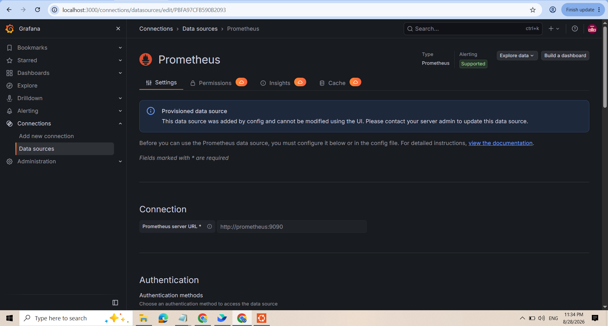

1. Khắc Phục Lỗi Mất Kết Nối Grafana - Prometheus Do Hardcode IP

Bước 1: Cấu hình Provisioning và docker-compose.yml

1. Tạo file prometheus.yml
global:
  scrape_interval: 5s

scrape_configs:
  - job_name: 'prometheus'
    static_configs:
      - targets: ['localhost:9090']   

3. Tạo file grafana/provisioning/datasources/datasource.yml sửa lỗi Hardcode IP:

apiVersion: 1
datasources:
  - name: Prometheus
    type: prometheus
    url: http://prometheus:9090
    access: proxy
    isDefault: true

3. Tạo file docker-compose.yml mount tự động file provisioning vào Grafana container:

services:
  prometheus:
    image: prom/prometheus:latest
    container_name: prometheus
    restart: unless-stopped
    ports:
      - "9090:9090"
    volumes:
      - ./prometheus.yml:/etc/prometheus/prometheus.yml

  grafana:
    image: grafana/grafana:latest
    container_name: grafana
    restart: unless-stopped
    ports:
      - "3000:3000"
    volumes:
      - ./grafana/provisioning/datasources:/etc/grafana/provisioning/datasources
    depends_on:
      - prometheus

4. Khởi chạy lại hệ thống bằng Docker Compose:

docker compose up -d

Bước 2: Kiểm thử và chụp ảnh bằng chứng

Truy cập http://localhost:3000 vào mục Connections -> Data sources -> Prometheus để kiểm tra:

### 🖼️ Ảnh 1: Kết nối Data Source Prometheus thành công qua DNS nội bộ http://prometheus:9090 (Provisioned)

2. Giải Thích Lý Thuyết & Đáp Án

Nguyên nhân lỗi "No data" do Hardcode IP (192.168.1.15):
- Khi container Docker khởi động lại hoặc recreate, Docker daemon sẽ cấp phát lại một địa chỉ IP động mới cho container trong dải mạng bridge.
- Việc hardcode địa chỉ IP tĩnh (như 192.168.1.15) vào file cấu hình khiến Grafana tiếp tục gửi request đến địa chỉ IP cũ đã không còn tồn tại hoặc thuộc về container khác, dẫn đến lỗi kết nối timeout / connection refused.

Giải pháp sử dụng Docker Embedded DNS (Service Name):
- Sửa URL trong `datasource.yml` thành `http://prometheus:9090`.
- Trong cùng một mạng Docker Compose (Default Bridge Network), cơ chế Docker Embedded DNS sẽ tự động phân giải tên service `prometheus` thành địa chỉ IP nội bộ chính xác của container Prometheus tại thời điểm thực thi.
- Giúp hệ thống hoạt động ổn định, không bị ảnh hưởng mỗi khi container khởi động lại hoặc thay đổi IP.
